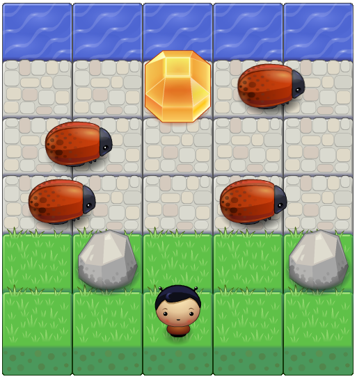

# frontend-nanodegree-arcade-game

## How to play:
* Download and open the project in the browser locally, then open index.html
* Use ↑up, ↓down, ←left, →right from keybord to move character 
* When player hit bug, you lose 10 scores
* When player drop into water, you lose 5 scores
* When player get a gem, you add 5 scores

## Get 50 scores and win the game!

